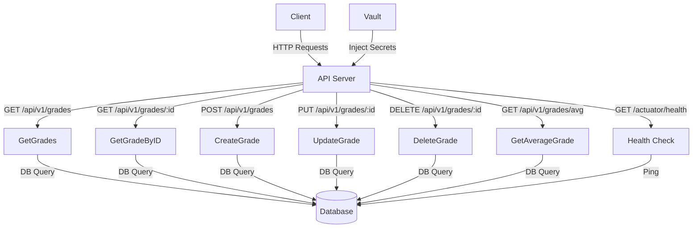

# DevOps Server

This is a Grades service application built with Go.
It provides APIs to manage grades and includes health checks and metrics.

## Configuration

### Environment Variables
| Variable | Description |
|--|--|
| LIBRA_SERVER_PORT |Port for the server to run on  |
| LIBRA_STATSD_HOST | Host for StatsD |
| LIBRA_STATSD_PORT | Port for StatsD |
| LIBRA_STATSD_SERVICENAME | Service name for StatsD |
| LIBRA_DB_HOST | Database host |
| LIBRA_DB_PORT | Database port |
| LIBRA_DB_USER | Database user |
| LIBRA_DB_PASSWORD | Database password | 
| LIBRA_DB_DATABASE | Database name |

## Endpoints

-   **`GET /api/v1/grades`** - Retrieve all grades

    ```sh
    curl -X GET http://localhost:8080/api/v1/grades
    
    ```

-   **`GET /api/v1/grades/:id`** - Retrieve a grade by ID

    ```sh
    curl -X GET http://localhost:8080/api/v1/grades/1
    
    ```

-   **`POST /api/v1/grades`** - Create a new grade

    ```sh
    curl -X POST http://localhost:8080/api/v1/grades \
      -H "Content-Type: application/json" \
      -d '{"studentName": "John Doe", "email": "john.doe@example.com", "class": "Math", "grade": 90}'
    
    ```

-   **`PUT /api/v1/grades/:id`** - Update an existing grade

    ```sh
    curl -X PUT http://localhost:8080/api/v1/grades/1 \
      -H "Content-Type: application/json" \
      -d '{"studentName": "John Doe", "email": "john.doe@example.com", "class": "Math", "grade": 95}'
    
    ```

-   **`DELETE /api/v1/grades/:id`** - Delete a grade

    ```sh
    curl -X DELETE http://localhost:8080/api/v1/grades/1
    
    ```

-   **`GET /api/v1/grades/avg`** - Compute and return the average grade

    ```sh
    curl -X GET http://localhost:8080/api/v1/grades/avg
    
    ```

-   **`GET /actuator/health`** - Health check endpoint

    ```sh
    curl -X GET http://localhost:8080/actuator/health
    
    ```

## Secret Management with HashiCorp Vault

The application supports retrieving database credentials from HashiCorp Vault. This provides a more secure approach to managing sensitive information compared to using environment variables or configuration files directly.

### How It Works

1. The Kubernetes pod is configured with Vault Agent Injector annotations in the deployment.
2. The Vault Agent injects the secrets into the pod at `/vault/secrets/db-creds`.
3. During initialization, the application checks for the existence of this file.
4. If the file exists, the application loads the environment variables from it.
5. These environment variables override any defaults or settings in the configuration file.

### Relevant Code

The following code in `cmd/initializer.go` handles the loading of secrets from Vault:

```go
// Check for Vault secrets and load them if available
vaultSecretsFile := "/vault/secrets/db-creds"
if _, err := os.Stat(vaultSecretsFile); err == nil {
    log.Info().Msgf("Found Vault secrets file. Loading environment variables from it.")
    cmd := exec.Command("sh", "-c", "source "+vaultSecretsFile)
    cmd.Stdout = os.Stdout
    cmd.Stderr = os.Stderr
    if err := cmd.Run(); err != nil {
        log.Error().Err(err).Msg("Failed to source Vault secrets")
    } else {
        log.Info().Msg("Successfully loaded environment variables from Vault")
    }
}
```

### Deployment Configuration

In Kubernetes, the pod template includes annotations that configure the Vault Agent Injector:

```yaml
additionalPodAnnotations:
  vault.hashicorp.com/agent-inject: "true"
  vault.hashicorp.com/role: "grades-api"
  vault.hashicorp.com/agent-inject-secret-db-creds: "kv/data/grades-api/db"
  vault.hashicorp.com/agent-inject-template-db-creds: |
    {{- with secret "kv/data/grades-api/db" -}}
    export LIBRA_DB_USER="{{ .Data.data.POSTGRES_USER }}"
    export LIBRA_DB_PASSWORD="{{ .Data.data.POSTGRES_PASSWORD }}"
    export LIBRA_DB_DATABASE="{{ .Data.data.POSTGRES_DB }}"
    {{- end -}}
```

### Setup Steps

To configure Vault for secret injection:

1. Initialize and unseal Vault
2. Enable KV Secrets Engine:
   ```bash
   vault secrets enable -path=kv kv-v2
   ```
3. Create the database secrets:
   ```bash
   vault kv put kv/grades-api/db \
     POSTGRES_USER=postgres \
     POSTGRES_PASSWORD=postgres \
     POSTGRES_DB=gradesdb
   ```
4. Enable Kubernetes authentication:
   ```bash
   vault auth enable kubernetes
   ```
5. Configure Kubernetes authentication:
   ```bash
   vault write auth/kubernetes/config \
     kubernetes_host="https://kubernetes.default.svc:443" \
     token_reviewer_jwt="$(cat /var/run/secrets/kubernetes.io/serviceaccount/token)" \
     kubernetes_ca_cert="$(cat /var/run/secrets/kubernetes.io/serviceaccount/ca.crt)" \
     disable_local_ca_jwt=true
   ```
6. Create a policy for accessing the secrets:
   ```bash
   vault policy write grades-api-policy - << EOF
   path "kv/data/grades-api/db" {
     capabilities = ["read"]
   }
   EOF
   ```
7. Create a role for the service account:
   ```bash
   vault write auth/kubernetes/role/grades-api \
     bound_service_account_names=grades-api \
     bound_service_account_namespaces=dvir-api \
     policies=grades-api-policy \
     ttl=24h
   ```

These steps allow the application pod to authenticate with Vault using its service account and retrieve the database credentials securely.

## Architecture

