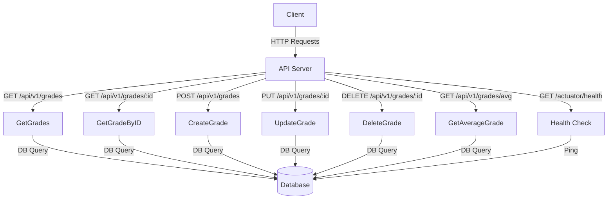

# DevOps Server

This is a Grades service  application built with Go.
It provides APIs to manage grades and includes health checks and metrics.

## Configuration

### Environment Variables
| Variable | Description |
|--|--|
| LIBRA_SERVER_PORT |Port for the server to run on  |
| LIBRA_STATSD_HOST | Host for StatsD |
| LIBRA_STATSD_PORT | Port for StatsD |
| LIBRA_STATSD_SERVICENAME | Service name for StatsD |
| LIBRA_DB_HOST | Database host |
| LIBRA_DB_PORT | Database port |
| LIBRA_DB_USER | Database user |
| LIBRA_DB_PASSWORD | Database password | 
| LIBRA_DB_DATABASE | Database name |

## Endpoints

-   **`GET /api/v1/grades`** - Retrieve all grades

    ```sh
    curl -X GET http://localhost:8080/api/v1/grades
    
    ```

-   **`GET /api/v1/grades/:id`** - Retrieve a grade by ID

    ```sh
    curl -X GET http://localhost:8080/api/v1/grades/1
    
    ```

-   **`POST /api/v1/grades`** - Create a new grade

    ```sh
    curl -X POST http://localhost:8080/api/v1/grades \
      -H "Content-Type: application/json" \
      -d '{"studentName": "John Doe", "email": "john.doe@example.com", "class": "Math", "grade": 90}'
    
    ```

-   **`PUT /api/v1/grades/:id`** - Update an existing grade

    ```sh
    curl -X PUT http://localhost:8080/api/v1/grades/1 \
      -H "Content-Type: application/json" \
      -d '{"studentName": "John Doe", "email": "john.doe@example.com", "class": "Math", "grade": 95}'
    
    ```

-   **`DELETE /api/v1/grades/:id`** - Delete a grade

    ```sh
    curl -X DELETE http://localhost:8080/api/v1/grades/1
    
    ```

-   **`GET /api/v1/grades/avg`** - Compute and return the average grade

    ```sh
    curl -X GET http://localhost:8080/api/v1/grades/avg
    
    ```

-   **`GET /actuator/health`** - Health check endpoint

    ```sh
    curl -X GET http://localhost:8080/actuator/health
    
    ```


## Architecture

